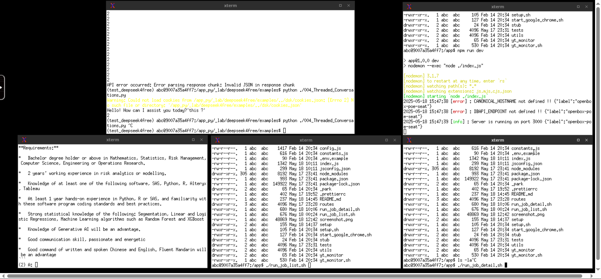

# README

## Purpose

This project helps louis find job

### Limitatins and Constrains

> As this project using **NON OFFICAL** reverse engineering of deepseek's web interface 💸💸💸
> deepseek may apply limitation to the high token application.

## Spin up

This project consists 3 parts, they are

- docker (for application running)
- javascript (scrape job ad)
- python (work with deepseek)
- pocketbase (data storage)

### directory structure

```bash
.
├── docker
│   ├── docker-chromium  # vnc for programs run
│   ├── pocketbase       # home of db
│   ├── src              # home of js projects (e.g. scrapers, extractors, endpoints)
│   ├── src_py           # home of py projects (e.g. deepseek4free api)
│   └── volumes          # persistent docker volume storage
├── docs
└── pocketbase
    ├── pb_hooks         # home of db hooks / event source code
    └── pb_migrations    # home of db schemas
```

### docker

```bash
$ cd docker
$ ./dc_up.sh
```

### javascript

```bash
# inside docker, src mapped to /app
cd /app

# server side
$ npm run start

# fetch job list
$ ./run_job_list.sh

# fetch job detail
$ ./run_job_detail.sh
```

### python

### run (docker_reporting)

> TODO: fill the remaining, seperate docker_reporting, docker_chrome

```bash
# install python version
$ pyenv install 3.11

# go to source directory
$ cd app_reporting

# create virtualenv
$ pyenv virtualenv 3.11 test_deepseek4free
$ pyenv activate test_deepseek4free

# install requirement to virtualenv
$ pip install -r requirements.txt

```

#### setup virtualenv

```bash
# install python version
$ pyenv install 3.11

# go to source directory
$ cd _lab/deepseek4free

# create virtualenv
$ pyenv virtualenv 3.11 test_deepseek4free
$ pyenv activate test_deepseek4free

# install requirement to virtualenv
$ pip install -r requirements.txt

```

#### run

```bash
## inside docker, src_py mapped to /app_py
cd app_py

# activate virtualenv
$ pyenv activate test_deepseek4free

# single shoot
$ python ./main.py

# run every 1800 ~ 3600 sec
$ ./run_ds.sh
```

## pocketbase

```bash
username: [ask_louis]
password: [ask_louis]
```

### Flow (HLD)


source: [flow_HLD](./docs/flow_HLD.md)


source: [block_HLD](./docs/block_HLD.md)

### running screen


