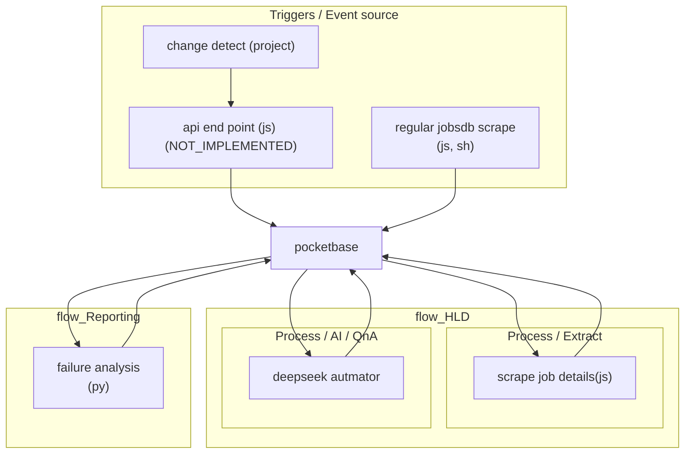

```mermaid
flowchart TD

  subgraph Triggers / Event source
    a["change detect (project)"]
    g["api end point (js) (NOT_IMPLEMENTED)"]
    b["regular jobsdb scrape <br>(js, sh)"]
  end

  subgraph flow_HLD
    subgraph Process / Extract
      c["scrape job details(js)"]
    end

    subgraph Process / AI / QnA
      d["deepseek autmator"]
    end
  end

  subgraph flow_Reporting
    e["failure analysis <br> (py)"]
  end

  f["pocketbase"]

  a --> g
  g --> f
  b --> f

  f --> c
  c --> f

  e --> f
  f --> e

  d --> f
  f --> d

```
