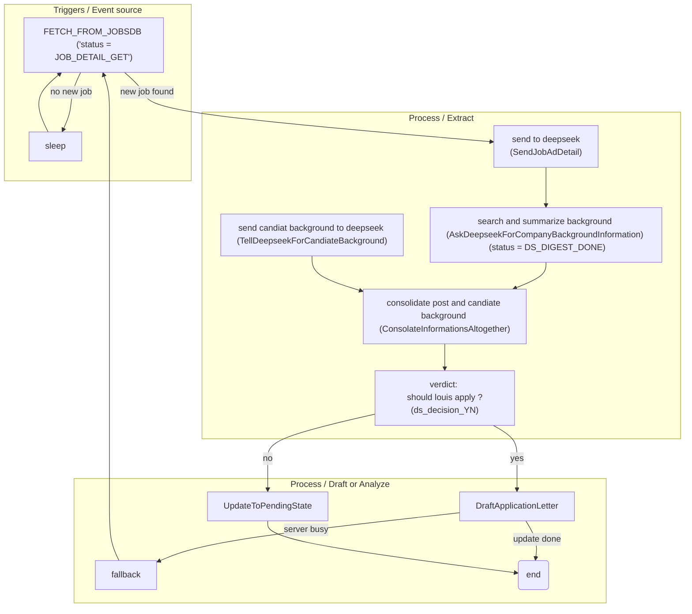

```mermaid
flowchart TD
  subgraph Triggers / Event source
    a["FETCH_FROM_JOBSDB <br> ('status = JOB_DETAIL_GET')"]
    a2["sleep"]
  end

  subgraph Process / Extract
    a1["send to deepseek <br>(SendJobAdDetail)"]
    b1["search and summarize background (AskDeepseekForCompanyBackgroundInformation) <br> (status = DS_DIGEST_DONE)"]
    b2["send candiat background to deepseek <br>(TellDeepseekForCandiateBackground)"]
    c["consolidate post and candiate background (ConsolateInformationsAltogether)"]
    d["verdict: <br> should louis apply ? (ds_decision_YN)"]
  end

  subgraph Process / Draft or Analyze

    e["DraftApplicationLetter"]
    f["UpdateToPendingState"]
    g["fallback"]

    zzz("end")
  end

  a -- no new job --> a2
  a2 --> a

  a -- new job found --> a1
  a1 --> b1
  b1 --> c
  b2 --> c
  c --> d
  d -- yes --> e
  d -- no --> f

  e -- server busy --> g
  g --> a
  e -- update done --> zzz
  f --> zzz
```
