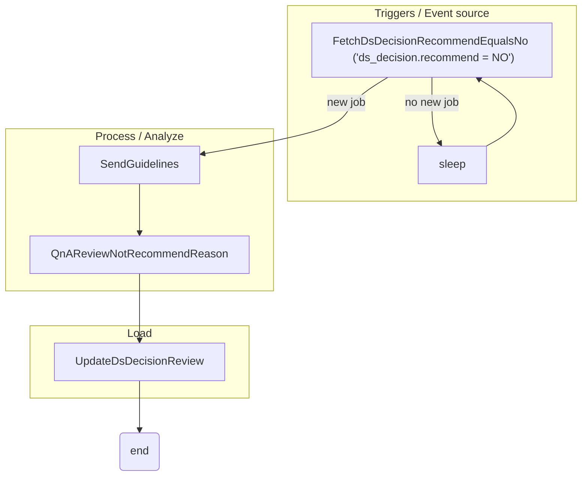

```mermaid
flowchart TD
  subgraph Triggers / Event source
    a["FetchDsDecisionRecommendEqualsNo <br> ('ds_decision.recommend = NO')"]
    a2["sleep"]
  end

  subgraph Process / Analyze
    a3["SendGuidelines"]
    a4["QnAReviewNotRecommendReason"]
  end

  subgraph Load
    a5["UpdateDsDecisionReview"]
  end

    zzz("end")

  a -- no new job --> a2
  a2  --> a

  a -- new job --> a3

  a3 --> a4
  a4 --> a5

  a5 --> zzz

```
